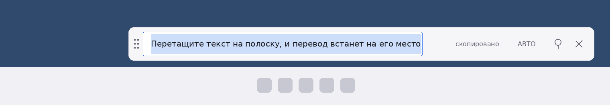

# Translatorlight

Маленький виджет-переводчик для Windows 11. Это полоска в одну строку: она висит
поверх остальных окон у самой панели задач и ждёт текста. Выделили английскую
фразу в браузере, в PDF или в переписке, потянули мышью на полоску — и перевод
встаёт **на место исходного текста, в том же поле**, уже выделенный целиком и уже
скопированный в буфер. Остаётся нажать Ctrl+V там, где он нужен.



Если текста под рукой нет, щёлкните по полоске и просто напечатайте фразу:
Enter переведёт её.

> [!NOTE]
> Версия ранняя: код собирается в CI, но на живой Windows обкатан мало. Если
> что-то ведёт себя не так, это, скорее всего, ошибка, а не задумка.

## Как этим пользоваться

| Действие | Что происходит |
| --- | --- |
| Перетащить выделенный текст на полоску | Перевод встаёт в поле вместо оригинала — выделенный и в буфере обмена |
| Щёлкнуть по полоске и напечатать текст | Курсор встаёт в поле; Enter переводит |
| Ctrl+V в поле, затем Enter | Переводит то, что было в буфере обмена |
| Ctrl+C | Копирует перевод целиком, даже ту часть, что не поместилась |
| Левая кнопка по значку в трее | Показать или спрятать полоску |
| Правая кнопка по значку | Меню: направление, сервис, «прижать к панели задач», выход |
| Esc | Очищает поле, а если оно пустое — прячет виджет |
| F5 | Перевести тот же текст заново |

Полоску таскают за точки слева, ширину меняют, потянув за правый край. Высота
всегда одна строка — она и не должна быть больше.

Перетаскивать можно не только выделенный текст: виджет принимает фрагмент
веб-страницы вместе с разметкой (её он вычистит) и текстовый файл, брошенный из
проводника — `.txt`, `.md`, `.srt`, `.csv` и подобные.

> [!IMPORTANT]
> Windows 11 по умолчанию прячет новые значки в «карман» — стрелочку слева от
> часов. Чтобы значок всегда был под рукой, вытащите его на панель задач:
> **Параметры → Персонализация → Панель задач → Другие значки в области
> уведомлений → Translatorlight → Вкл.** Либо просто перетащите значок из
> «кармана» на панель задач мышью.

## Одна строка и длинный перевод

Перевод редко помещается в одну строку — и не должен. Поэтому он выделяется
целиком, включая то, что ушло за правый край поля: Ctrl+C заберёт весь текст, а
не видимый кусок. Полоска при этом показывает **начало** перевода, а не хвост —
выделение ставится «от конца к началу», иначе поле прокрутилось бы к последнему
символу.

Перевод к тому же сразу кладётся в буфер обмена, так что чаще всего копировать
ничего и не нужно — достаточно Ctrl+V. Если это мешает, отключите **«Сразу
копировать перевод»** в меню: выделение останется.

Виджет никогда не забирает себе фокус ввода — ни при запуске, ни когда на него
что-то бросают. Вы перетащили текст, не отрываясь от своего окна, и в нём же
нажали Ctrl+V.

## С какого языка на какой

По умолчанию направление выбирается по самому тексту: латиница переводится на
русский, кириллица — на английский. Это удобно, когда изредка нужно и обратно.
В меню направление можно закрепить: **Всегда EN → RU** или **Всегда RU → EN**.
Текущее направление написано на полоске справа («АВТО», «EN→RU», «RU→EN»), и там
же оно переключается щелчком.

Побочная приятность авторежима: нажмите Enter на готовом переводе — и он
переведётся обратно, в то же поле.

## Чем переводит

Тремя бесплатными сервисами подряд: **Google**, **MyMemory**, **Lingva**. Ключи и
регистрация не нужны, нужен только интернет. Если первый сервис молчит, отвечает
ошибкой или исчерпал дневной лимит, виджет молча берёт следующий — пауза выходит
в секунду, а не в отказ. В меню можно поставить первым любой из них; остальные
останутся подстраховкой.

Длинный текст режется на куски по границам абзацев и предложений, переводится по
частям и снова собирается вместе, поэтому абзацы не слипаются. За один раз виджет
берёт не больше 5000 знаков — он для фраз и абзацев, а не для книг.

## Настройки

Всё настраивается из меню по правой кнопке по значку:

- **Направление** — авто, всегда EN → RU или всегда RU → EN.
- **Сервис перевода** — какой из трёх пробовать первым.
- **Прижать к панели задач** — поставить полоску в угол над панелью задач.
- **Поверх всех окон** — чтобы на полоску всегда было куда бросить текст.
  По умолчанию включено.
- **Сразу копировать перевод** — класть перевод в буфер обмена. По умолчанию включено.
- **Приглушать, пока не активен** — полоска становится чуть прозрачной, когда вы
  работаете в другом окне, и снова плотной, когда на неё тянут текст.
- **Запускаться свёрнутым** — при старте показывать только значок в трее.
- **Запускать вместе с Windows** — запись в ветку реестра `Run`.

Настройки, ширина и положение полоски хранятся в
`%APPDATA%\Translatorlight\settings.json` и переживают перезапуск. Испорченный
файл не мешает запуску — программа просто вернётся к значениям по умолчанию.

## Установка

Готовый `Translatorlight.exe` лежит в [релизах](../../releases): скачайте файл из
последнего. Это самодостаточный файл — .NET ставить не нужно, программа не
требует установки и прав администратора. Положите его в любую папку и запустите.

Сборку каждой ветки можно взять и во вкладке **Actions** — артефакт
`Translatorlight-win-x64`.

## Сборка из исходников

Нужен [.NET 8 SDK](https://dotnet.microsoft.com/download/dotnet/8.0).

```powershell
dotnet publish src\Translatorlight\Translatorlight.csproj -c Release -r win-x64 `
  --self-contained true -p:PublishSingleFile=true -p:EnableCompressionInSingleFile=true `
  -o publish
```

Готовый файл окажется в `publish\Translatorlight.exe`.

Проект собирается и с Linux или macOS (в csproj включён `EnableWindowsTargeting`),
что и делает workflow в `.github/workflows/build.yml`.

## Как устроено

| Файл | Зачем |
| --- | --- |
| `src/Translatorlight/Program.cs` | Точка входа, защита от второго запуска |
| `src/Translatorlight/WidgetForm.cs` | Сама полоска: поле, приём перетаскивания, перенос и ширина окна |
| `src/Translatorlight/TrayApplicationContext.cs` | Значок в трее, меню, состояние значка |
| `src/Translatorlight/Translator.cs` | Выбор направления, нарезка текста, перебор сервисов |
| `src/Translatorlight/TranslationProviders.cs` | Google, MyMemory, Lingva и общий HTTP-клиент |
| `src/Translatorlight/DroppedText.cs` | Достаёт текст из перетащенного: текст, HTML, файл |
| `src/Translatorlight/TrayIconRenderer.cs` | Рисование значка в трее |
| `src/Translatorlight/AppSettings.cs` | Чтение и запись `settings.json` |
| `src/Translatorlight/Autostart.cs` | Запись в ветку реестра `Run` |
| `tools/generate_icon.py` | Генерация `translatorlight.ico` — значка самого exe |
| `tools/generate_preview.py` | Генерация `docs/preview.png` для этого README |

Высота полоски не задана числом: она считается от высоты строки того шрифта,
которым набрано поле, поэтому одинаково верна и при 100 %, и при 150 % масштаба.
Растягивать вертикально нечего — минимальный и максимальный размер окна по высоте
совпадают, и остаётся только ширина.

Поле — многострочный текстовый блок ростом ровно в строку, с выключенным
переносом. Так в нём сохраняются переводы строк исходного текста (в однострочном
поле Windows они превратились бы в мусор), а всё, что не поместилось, просто
уезжает за край, оставаясь выделенным.

Окно без рамки: заголовка и рамки Windows нет, поэтому перенос окна отдан самой
Windows — при нажатии на точки слева окну посылается то же сообщение, которое оно
получает при перетаскивании за настоящий заголовок. Нажатие без движения — это
обычный щелчок, и он просто ставит курсор в поле. Углы скругляет сама Windows 11;
на Windows 10 полоска останется прямоугольной.

Приёмником перетаскивания объявлено каждое поле виджета, а не только окно
целиком: иначе текст, брошенный на само поле, не дошёл бы до обработчика.
Побочный эффект — когда курсор идёт по полоске от поля к полю, Windows успевает
сообщить «перетаскивание ушло», и подсветка мигала бы; поэтому она гаснет не
сразу, а спустя долю секунды, если новое «пришло» так и не случилось.

Цвета полоски и значка берутся из настроек Windows: светлая тема — светлая
полоска, тёмная — тёмная. Значок в трее рисуется кодом на условном холсте 100×100
и масштабируется под запрошенный размер. Пока идёт перевод, он серый, при
ошибке — красный.

Скрипты в `tools/` нужны только для пересборки картинок, на сборку программы они
не влияют:

```bash
pip install Pillow
python3 tools/generate_icon.py
python3 tools/generate_preview.py
```
